# 호두샵
## 1.목표와 기능

### 1.1목표
- 유저를 판매자와 구매자로 구분하여 상품을 판매,구매하는 서비스
- 바닐라 자바스크립트 멀티 페이지 어플리케이션 프로젝트
### 1.2 기능
- 완료된 기능
    - 메인 페이지 
    - 로그인 페이지
    - 회원가입 페이지
    - 상품 상세 페이지
    - 404 페이지
- 개발중인 기능
    - 장바구니 페이지
- 개발 예정 기능 
    - 판매자 페이지
    - 판매자 상품 등록 페이지
    - 판매자 센터 페이지
    - 주문 결제 페이지
    - 판매자 회원가입 기능
    - 판매자 로그인 기능

### 1.3 팀 구성
- 이휘경

## 2.기술 스택 및 배포
### 2.1 기술 스택 

### 2.2 배포 환경 및 배포 URL
- 서비스 배포 환경
    - github pages
- 배포 URL
    - https://leehwigyoung.github.io/open-market-service/

### 2.3 URL 구조
- main
    |URL|HTML FILE NAME | NOTE|
    |---|---|---|
    |'/'|docs/index.html| 홈 화면|
- login
    |URL|HTML FILE NAME | NOTE|
    |---|---|---|
    |'/login'|docs/login.html| 로그인 화면|
- join
    |URL|HTML FILE NAME | NOTE|
    |---|---|---|
    |'/join'|docs/join.html| 회원가입 화면|
- detailProduct
    |URL|HTML FILE NAME | NOTE|
    |---|---|---|
    |'/detail?id=product_id'|docs/detail.html| 상품 상세 화면|
- shoppingcart
    |URL|HTML FILE NAME | NOTE|
    |---|---|---|
    |'/shoppingcart'|docs/shoppingcart.html| 장바구니 화면|

## 3 요구사항 명세
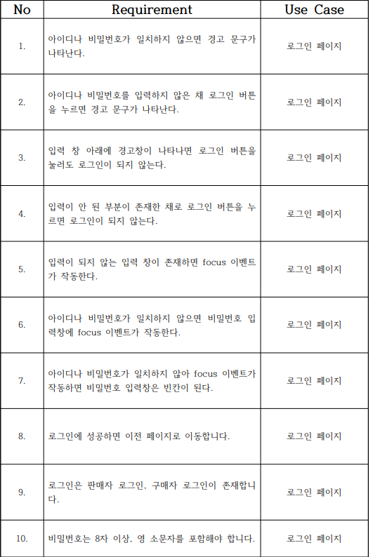

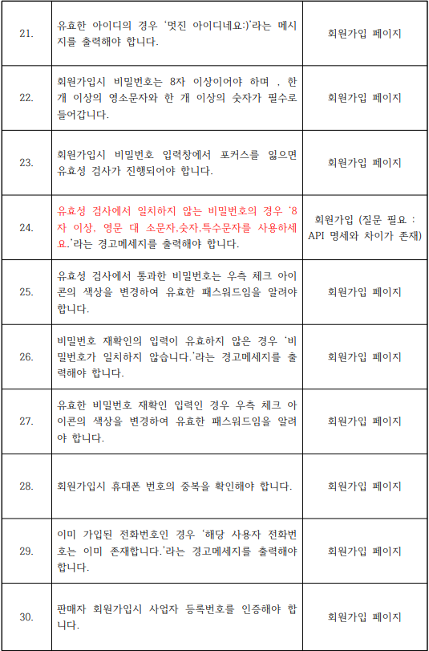
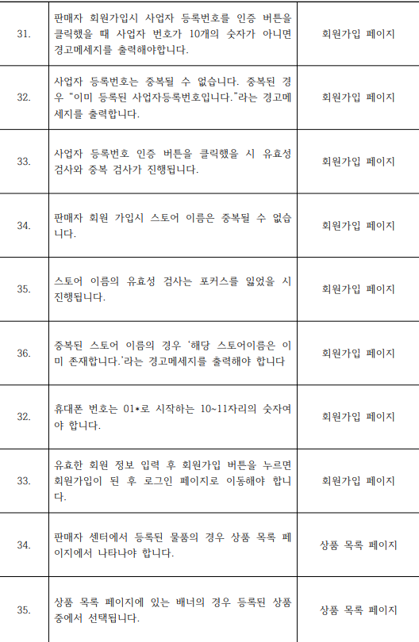
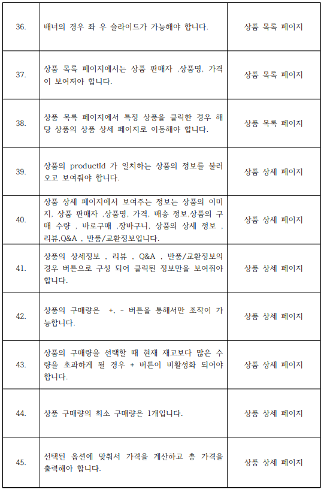
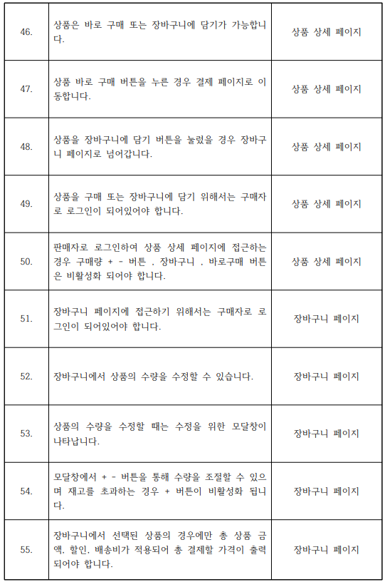

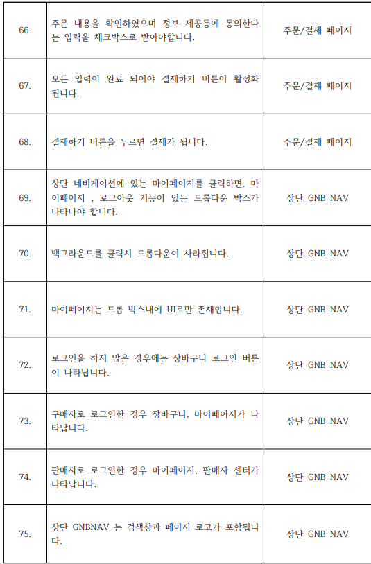

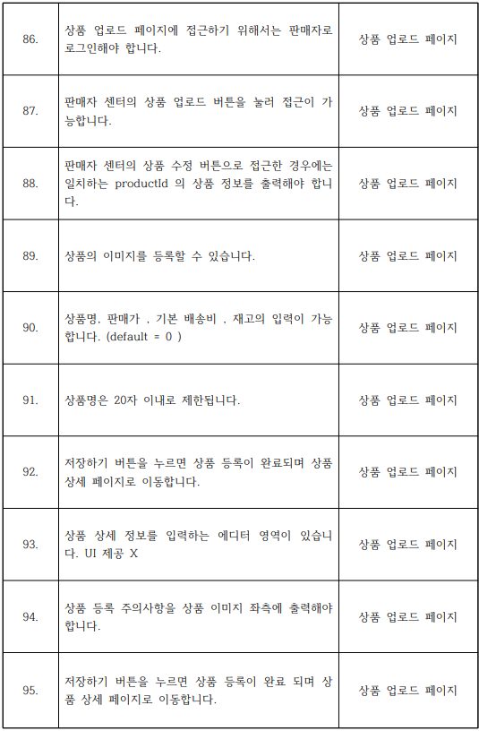
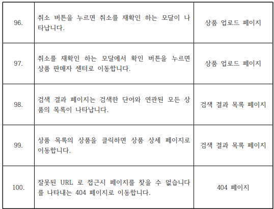
## 4 프로젝트 구조

### 4.1 프로젝트 구조

docs 
┣ 📂assets 
┃ 📂js 
┃ ┣ 📜about404.js 
┃ ┣ 📜auth.js 
┃ ┣ 📜details.js 
┃ ┣ 📜header.js 
┃ ┣ 📜home.js 
┃ ┣ 📜image_slider.js 
┃ ┣ 📜join.js 
┃ ┣ 📜login.js 
┃ ┣ 📜modal.js 
┃ ┣ 📜shoppingcart_list.js 
┃ ┣ 📜shoppingcart_utils.js 
┃ ┣ 📜shoppingcart.js 
┃ 📂css 
┃ ┣ 📜about404.css 
┃ ┣ 📜detail.css 
┃ ┣ 📜home.css 
┃ ┣ 📜join.css 
┃ ┣ 📜login.css 
┃ ┣ 📜modal.css 
┃ ┣ 📜reset.css 
┃ ┣ 📜shoppingcart.css 
┣ 📜404.html 
┣ 📜detail.html 
┣ 📜index.html 
┣ 📜join.html 
┣ 📜login.html 
┣ 📜shoppingcart.html 
┃  📜README.md 
┃  📜requirement.pdf 
┃  📜requirement.hwpx 
## 5. 화면 구성
 - 메인 페이지

 - 로그인 페이지

 - 회원 가입 페이지
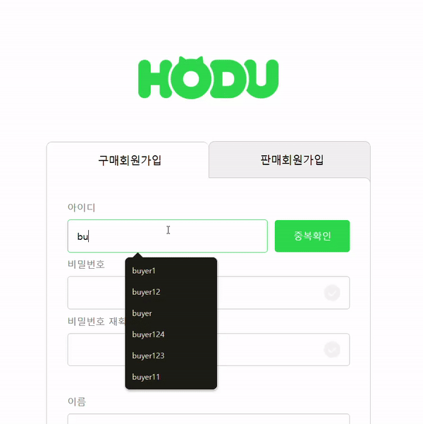
 - 상품 상세 페이지
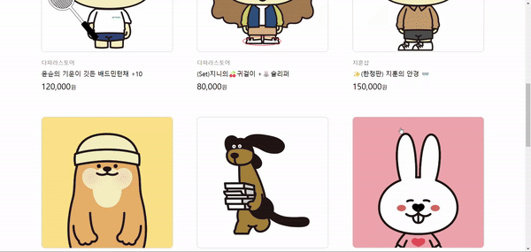
 - 장바구니 페이지

    -로그인 x

    
 
    -로그인 o

    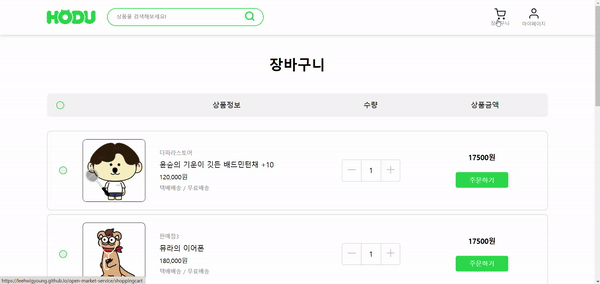

 - 로그 아웃 기능
 
## 6. 에러와 에러 해결
## 7. 개발하며 느낀점

## 8. 추후 개발
 - 도전과제인 장바구니 페이지 , 결제 페이지 , 판매자 회원, 판매자 로그인 , 판매자 센터 페이지를 MPA로 완성합니다.
 - 모바일을 지원하기 위해 반응형 웹으로 리팩토링 합니다.
 - SPA로 리팩토링을 진행합니다.
  
